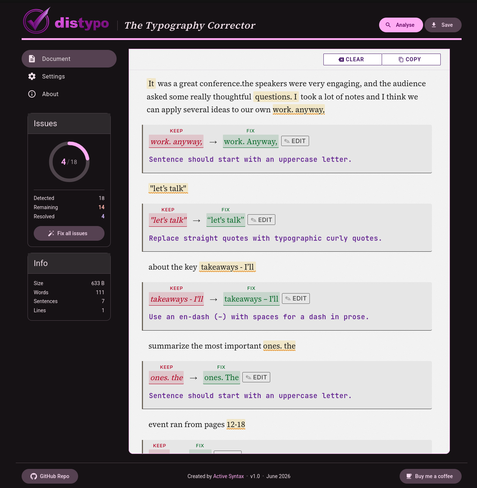

# DisTypo – Typography Correction Tool

DisTypo is a browser-based typography linter. Paste text, get precise corrections for the mechanical mistakes spell-checkers miss — wrong dashes, straight quotes, missing spaces, bad punctuation spacing. It does not rewrite prose. It only fixes what is unambiguously wrong.



---

## Features

- **14 built-in rules** — en-dash in numeric ranges, smart quotes, ellipsis normalization, sentence capitalization, punctuation spacing, apostrophes, and more
- **Inline correction display** — corrections are shown in context, not in a separate panel
- **Accept / keep / edit** — each correction can be accepted, dismissed, or replaced with custom text
- **Fix all** — apply every pending correction in one click
- **File input** — load text from a local file in addition to paste
- **Export** — download the corrected document as a plain-text file
- **Configurable rules** — enable or disable individual rules from the settings page with live preview
- **Text statistics** — word count, sentence count, line count, and byte size updated in real time

---

## Tech Stack

| Layer | Technology |
|---|---|
| Framework | Angular 21 (standalone API) |
| Language | TypeScript 5.9 — `strict: true` |
| UI | Angular Material 21 + CDK |
| State | Angular Signals — no external library |
| Styling | SCSS + Material theming |
| Testing | Vitest + jsdom |
| Fonts | Inter, JetBrains Mono, Source Serif 4 (variable, self-hosted) |
| Build | `@angular/build:application` (esbuild-based) |

---

## Architecture

The codebase is split into three distinct layers with a strict dependency direction: `core` → `state` → `ui`.

```
src/
├── core/               # Pure domain logic — zero Angular dependencies
│   ├── domain/
│   │   ├── model.ts    # Branded union types: RawDocument | LintedDocument | PolishedDocument
│   │   └── rules.ts    # Rule interface: id, regex, corrector
│   └── operations/
│       ├── lint.ts     # RawDocument → LintedDocument (detects corrections)
│       └── polish.ts   # LintedDocument → PolishedDocument (applies accepted corrections)
│
├── app/state/          # Reactive state — Angular signals only
│   ├── document-state.ts       # Central computed signal graph
│   ├── source/
│   │   └── content-source-store.ts  # Text input or file (httpResource)
│   └── segments.service.ts     # Resolves correction segments to plain text
│
├── app/                # UI — components read signals, never own state
│   ├── document-view/  # Main editor: textarea + segment overlay
│   ├── correction-view/        # Per-correction: keep / fix / edit
│   ├── inline-correction-view/ # Overlapping correction display
│   ├── settings/       # Rule toggles with live demo
│   ├── document-info/  # Text statistics
│   └── issues/         # Correction progress ring
│
├── config/             # Rule definitions and demo text
└── utils/              # Pure utility functions (array, interval, text-stats, fp)
```

### Reactive Data Flow

All derived state is expressed as a computed signal chain — no subscriptions, no manual invalidation:

```
ContentSourceStore.content()          // text input or fetched file
    ↓
DocumentState.raw                     // computed: RawDocument
    ↓ + RuleService.activeRules()
DocumentState.linted                  // computed: LintedDocument with Corrections[]
    ↓
DocumentState.segments                // computed: TextSegment[] | CorrectionSegment[]
    ↓ + CorrectionService.statuses()
View                                  // components render segments reactively
```

Polish (applying fixes) is a separate pass triggered on export or "fix all", keeping the display and output concerns separate.

---

## Angular & TypeScript Highlights

- **Standalone components throughout** — no NgModules; components, directives, and pipes are imported directly
- **`inject()` function** — constructor injection replaced entirely by the `inject()` API
- **Computed signals for all derived state** — `DocumentState` exposes only `computed()` values; no mutable state leaks to consumers
- **`httpResource`** — used in `ContentSourceStore` for declarative file fetching with loading and error signals out of the box
- **Branded union types** — `TextDocument = RawDocument | LintedDocument | PolishedDocument` encodes document lifecycle in the type system, preventing operations on the wrong stage
- **Strict TypeScript** — `strict: true`, `strictTemplates`, `strictInjectionParameters`, `strictInputAccessModifiers`
- **Path aliases** — `@core/*`, `@app/*`, `@config/*`, `@utils/*` for clean cross-layer imports
- **Lazy-loaded routes** — each page (`DocumentView`, `Settings`, `About`) is lazy-loaded with standard `loadComponent`
- **No RxJS in application code** — signals replace all observable-based patterns; RxJS remains a transitive peer dependency only

---

## Getting Started

```bash
cd distypo-app
npm install
npm start          # dev server at http://localhost:4200
npm test           # run Vitest unit tests
npm run build      # production build
```

---

## License

MIT — © 2026 [Active Syntax](https://github.com/activesyntax)
